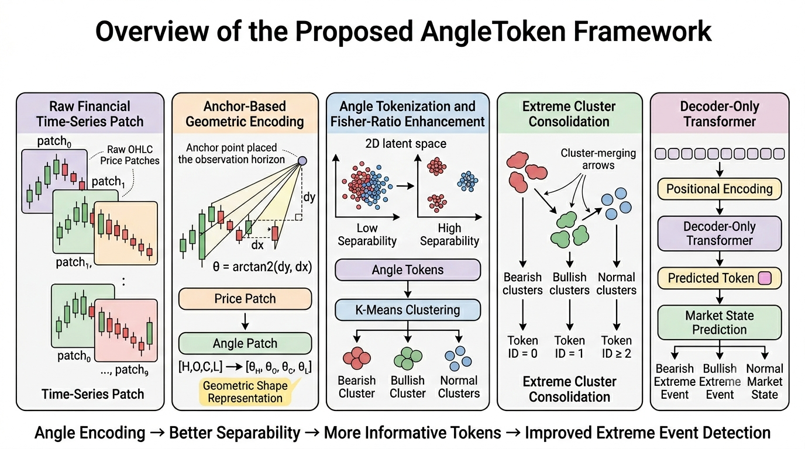

# AngleToken

This repository is used for reproducing the results presented in the paper **"AngleToken: Discriminative Financial Time Series Tokenization via Geometric Encoding"**.

## Overview

The following figure illustrates the overall concept and workflow of the proposed AngleToken framework.

*Figure 1. Conceptual overview of the AngleToken framework.*

---

## Repository Structure

text AngleToken/ ├── Implement_code.py ├── run_implement.py ├── global_index.zip ├── Overviewpic.png └── README.md 

### Implement_code.py

This file contains the complete implementation of the AngleToken framework, including:

- Data preprocessing and cleaning
- Window construction
- Geometric angle encoding
- Anchor point search
- Tokenization through clustering
- Transformer model training
- Prediction and evaluation

The code is fully documented with English comments to improve readability and reproducibility.

### run_implement.py

This script is used to execute the complete reproduction pipeline.

For the required software environment and package versions, please refer to the latest Google Colab runtime environment.

### global_index.zip

This archive contains the global market index datasets used in the experiments.

#### Data Source

Source: AKShare

The index data are obtained from the Chinese financial data platform AKShare. Therefore, the original column names and index descriptions are retained in Chinese.

The dataset includes the following market indices:

- S&P 500
- Dow Jones Industrial Average
- NASDAQ Composite
- FTSE 100
- DAX
- CAC 40
- Nikkei 225
- Hang Seng Index
- SSE 50
- CSI 300

---

## Reproduction

1. Extract global_index.zip into the project directory.
2. Ensure that all required Python packages are installed.
3. Use the environment provided by the latest Google Colab runtime, or install equivalent package versions locally.
4. Run:

bash python run_implement.py 

The script will automatically perform:

- Data loading
- Data preprocessing
- Window generation
- Angle encoding
- Anchor optimization
- Tokenization
- Transformer training
- Validation and testing
- Final evaluation

---

## Notes

- The original paper uses global financial market indices as the experimental dataset.
- Chinese column names are preserved because the raw data are directly downloaded from AKShare.
- Random seeds can be adjusted through the command-line arguments provided in the implementation.
- GPU acceleration is recommended for model training.

---

## Disclaimer

This repository is an independent reproduction implementation of the AngleToken framework for research and educational purposes. Please refer to the original paper for the official methodology and experimental settings.
